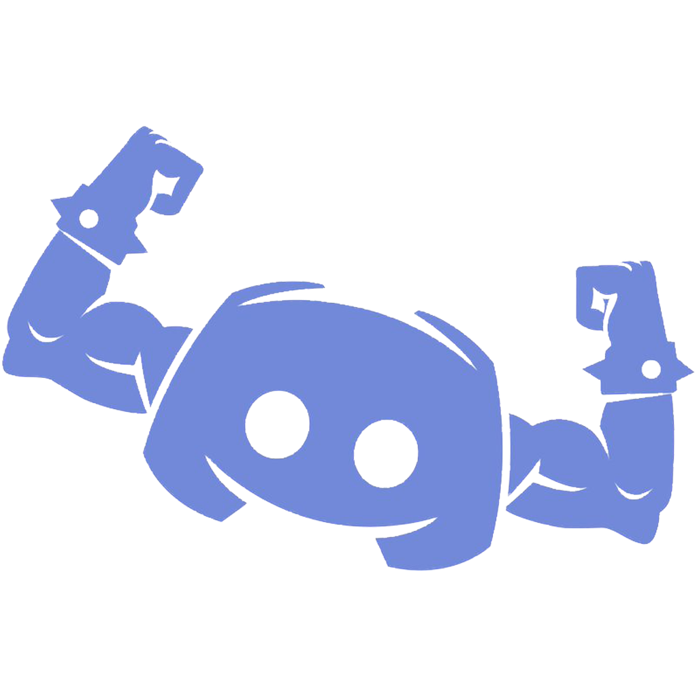

<p align="center">
  
</p>

<h1 align="center">DiscordTaskMasterBot est votre assistant polyvalent pour la gestion administrative sur Discord. Intégré de manière transparente, il simplifie la modération, facilite la communication et optimise votre serveur de manière efficace.</h1>
<hr>
<br>

## Fonctionnalités Clés
<hr>

- **Exécution des Tâches Complexes :** Automatise efficacement les actions nécessaires à la gestion quotidienne de votre serveur.
  
- **Modération Efficace :** Maintient l'ordre et la sécurité avec des outils sophistiqués de gestion des utilisateurs et de filtrage du contenu.
  
- **Communication Facilitée :** Accueille les nouveaux membres, envoie des messages personnalisés et maintient une interaction dynamique.
  
- **Optimisation Globale :** Utilise des stratégies intégrées pour améliorer l'efficacité opérationnelle et la convivialité de votre serveur.

<br>

## Prérequis
<hr>

Avant d'installer et de personnaliser DiscordTaskMasterBot, assurez-vous de disposer des éléments suivants :

1. **Node.js et npm :** Assurez-vous que Node.js est installé sur votre système. Vous pouvez le télécharger depuis [nodejs.org](https://nodejs.org/).
   
2. **Compte Discord et Bot :** Créez un compte sur Discord et assurez-vous d'avoir créé une application de bot sur [Discord Developer Portal](https://discord.com/developers/applications).

<br>

## Installation
<hr>

### Clonage du Répertoire

1. Clonez le dépôt depuis GitHub :
   ```bash
   git clone git@github.com:Xxzer042xX/discord_bot.git
   ```
2. deplacer vous a la racine du projet :
   ```bash
   cd discord_bot
   ```
<br>

### Installation des Dépendances

3. Installez les dépendances nécessaires :
   ```bash
   npm install
   ```

<br>

### Configuration des Variables d'Environnement

4. Créez un fichier `.env` à la racine du projet.
5. Ajoutez votre token Discord dans le fichier `.env` :
   ```
   DISCORD_TOKEN=VotreTokenDiscord
   ```

<br>

## Personnalisation
<hr>

### Configuration des IDs et Messages

1. **Roles et Canaux :** 
   - Ouvrez le fichier `commands.js` et remplacez `'ID_DU_ROLE'` par l'ID du rôle que vous souhaitez attribuer avec la commande que vous choisissez.
   - Remplacez `'ID_DU_CANAL_DE_BIENVENUE'` dans `handleDailyGreetings` par l'ID du canal où vous souhaitez envoyer les messages de bienvenue.
   - Assurez-vous de remplacer `'ID_DU_CANAL'` dans `countdownToAugust19` par l'ID du canal où vous souhaitez envoyer les messages de décompte.

2. **Messages :**
   - Personnalisez les messages dans les fonctions `handleCustomCommand`, `handleDailyGreetings`, et `countdownToAugust19` selon vos préférences.

3. **Nom de la Commande :**
   - Pour personnaliser le nom de la commande, ouvrez le fichier `index.js` et trouvez la fonction `handleCustomCommand`.
   - Modifiez `'!piscine'` par le nom de commande de votre choix, par exemple `'!moncommande'`.

<br>

## Utilisation
<hr>

### Démarrage du Bot

Pour lancer DiscordTaskMasterBot :

```bash
npm start
```

Assurez-vous que votre bot est invité sur votre serveur Discord et dispose des autorisations nécessaires pour fonctionner correctement.

<br>

## Contribution
<hr>

Vous pouvez contribuer au développement de DiscordTaskMasterBot en forquant le dépôt, créant une branche pour vos modifications, et soumettant une Pull Request.

1. Forker le dépôt.
2. Créer une branche pour vos modifications (`git checkout -b feature-ameliorations`).
3. Commiter vos changements (`git commit -am 'Ajout de nouvelles fonctionnalités'`).
4. Pousser la branche (`git push origin feature-ameliorations`).
5. Créer une nouvelle Pull Request.

## Licence

Ce projet est sous licence [ISC](https://opensource.org/licenses/ISC).

